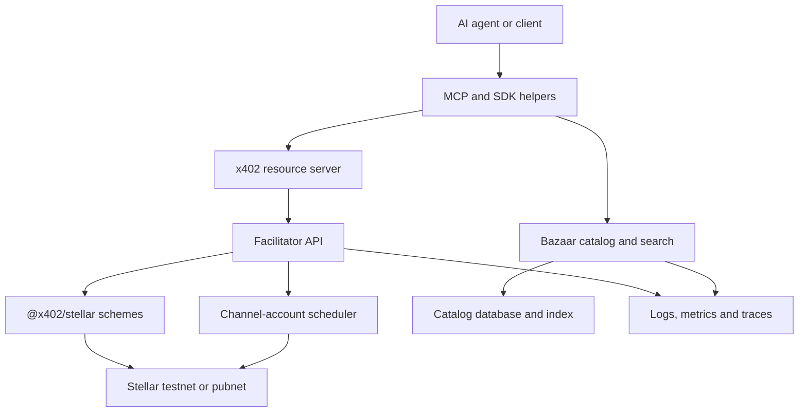

# AiFinPay Stellar x402 Facilitator

Open-source, self-hostable x402 infrastructure for Stellar: a conformant facilitator, Bazaar discovery, MCP agent tools, SDK helpers, and production operations for `stellar:testnet` and `stellar:pubnet`.

> **Status: proposal and architecture phase.** No production release exists yet. This repository is the implementation home and evidence package for AiFinPay's SCF #45 RFP submission. Items marked **Planned** are grant deliverables, not completed features.

[](LICENSE)
[](SECURITY.md)
[](docs/grant/SCF45_APPLICATION.md)

## Why this exists

Stellar already has conformant `exact` settlement through [`@x402/stellar`](https://www.npmjs.com/package/@x402/stellar) and reference tooling in [`stellar/x402-stellar`](https://github.com/stellar/x402-stellar). The missing layer described by the SCF #45 RFP is broader:

- a production-grade hosted and self-hosted facilitator;
- a Stellar-native Bazaar catalog and natural-language search service;
- automatic discovery of HTTP and MCP resources;
- an MCP server that lets agents discover, pay, and retry;
- a Stellar design and upstream contribution for the x402 `upto` scheme;
- wire-level conformance, security review, documentation, monitoring, and maintenance.

This project will build on the canonical packages instead of reimplementing solved settlement logic.

## Planned product surface

| Component   | Responsibility                                                         | Status              |
| ----------- | ---------------------------------------------------------------------- | ------------------- |
| Facilitator | `/verify`, `/settle`, `/supported` on testnet and pubnet               | Planned             |
| Bazaar      | `/discovery/resources`, `/discovery/search`, safe automatic cataloging | Planned             |
| MCP server  | Resource search and paid-call proxy with deterministic errors          | Planned             |
| `exact`     | Canonical Stellar exact scheme via `@x402/stellar`                     | Planned integration |
| `upto`      | Stellar network spec and implementation contributed upstream           | Design draft        |
| SDK helpers | Seller metadata and buyer/agent discovery-payment helpers              | Planned             |
| Examples    | Paid discoverable API and MCP-driven paying agent                      | Planned             |
| Operations  | 99%+ availability target, monitoring, incident and key runbooks        | Planned             |

## Architecture



The facilitator validates canonical x402 v2 payloads, builds and submits Stellar invocations, and returns deterministic machine-readable results. The Bazaar indexes signed or verified resource metadata without becoming an authority over seller pricing. The MCP interface wraps discovery, payment, and retry for agent runtimes.

See [Architecture](docs/ARCHITECTURE.md) and [Plain-English system explanation](docs/SYSTEM_OVERVIEW.md).

## Hard acceptance gates

The project is not considered production-ready until all of the following are independently verifiable:

- an unmodified canonical x402 client completes an end-to-end payment on `stellar:testnet` and `stellar:pubnet`;
- `/supported` emits the required Stellar `extra` object, including `areFeesSponsored`;
- canonical `payload: { transaction }` input is accepted verbatim;
- the upstream x402 E2E suite passes on both networks;
- transaction hashes are published for each supported network and scheme;
- every rejection contains a non-null machine-readable reason;
- discovery prevents seller, endpoint, and price spoofing;
- a third-party security review is completed and findings are resolved;
- two end-to-end reference integrations and a role-based developer guide are live;
- production runbooks, monitoring, degraded-mode behavior, and maintenance ownership are documented.

## Repository map

```text
packages/              Planned facilitator, Bazaar, MCP, and SDK packages
examples/              Required end-to-end integrations
specs/                 Draft Stellar `upto` network specification
tests/conformance/     Wire, network, discovery, and MCP acceptance plan
docs/                  Architecture, security, operations, and developer docs
docs/grant/            Self-contained SCF #45 application materials
.github/               CI, issue forms, and pull request controls
```

## Grant documentation

The SCF panel evaluates only the content placed in the application form. External links are supporting evidence, not substitutes. The files below are written so their material can be copied into the submission:

- [Self-contained SCF #45 application draft](docs/grant/SCF45_APPLICATION.md)
- [RFP compliance matrix](docs/grant/RFP_COMPLIANCE_MATRIX.md)
- [Submission criteria checklist](docs/grant/SUBMISSION_CRITERIA_CHECKLIST.md)
- [Milestones and evidence](docs/grant/MILESTONES.md)
- [Budget methodology](docs/grant/BUDGET.md)
- [Team evidence requirements](docs/grant/TEAM.md)
- [Application evidence register](docs/grant/EVIDENCE_REGISTER.md)
- [Delivery risk register](docs/grant/RISK_REGISTER.md)

## Development baseline

The proposed baseline, to be pinned and verified when implementation begins, is:

- Node.js 22+
- TypeScript
- `@x402/core` and `@x402/stellar` from the latest stable x402 v2 release
- `@stellar/stellar-sdk`
- PostgreSQL with hybrid lexical/vector search for the catalog
- OpenTelemetry-compatible logs, metrics, and traces

No AGPL or strong-copyleft dependency may enter the runtime or network-service dependency path. See [Dependency Policy](DEPENDENCY_POLICY.md).

## Security

This software will handle real payment authorizations. Do not report vulnerabilities in public issues. Follow [SECURITY.md](SECURITY.md). Never commit private keys, seed phrases, channel-account secrets, API keys, or production configuration.

## Contributing

Contributions are welcome under the [Apache License 2.0](LICENSE). Read [CONTRIBUTING.md](CONTRIBUTING.md), the [Code of Conduct](CODE_OF_CONDUCT.md), and the [governance model](GOVERNANCE.md) before opening a pull request.

## License and trademarks

Copyright 2026 AiFinPay. Licensed under Apache-2.0. See [LICENSE](LICENSE), [NOTICE](NOTICE), and [TRADEMARKS.md](TRADEMARKS.md). Third-party marks belong to their respective owners. This project is not represented as endorsed by SDF or the x402 Foundation.
