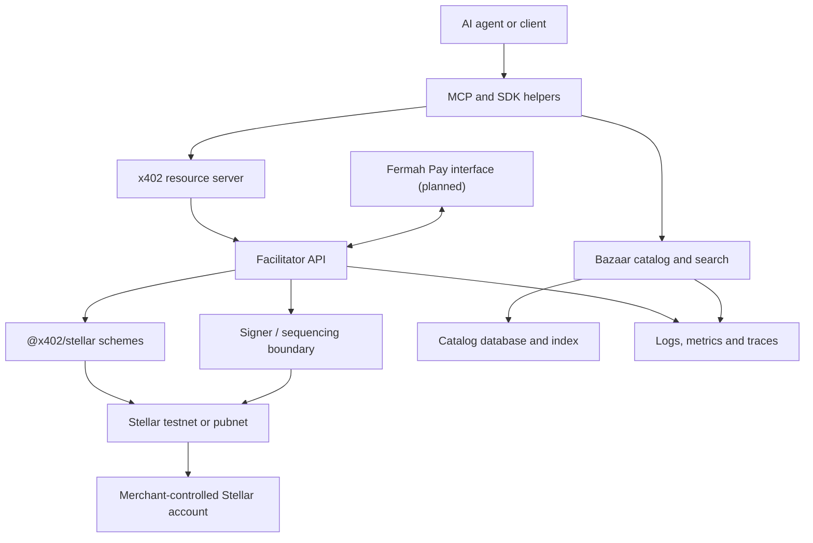

# AiFinPay Stellar x402 Facilitator

Open-source, self-hostable x402 infrastructure for Stellar: a conformant facilitator, Bazaar discovery, MCP agent tools, SDK helpers, and production operations for `stellar:testnet` and `stellar:pubnet`.

> **Status: SCF #45 panel review / implementation-ready design.** The repository contains the architecture, security model, named delivery team, USD 90,000 budget, milestones and acceptance evidence plan. The Stellar facilitator implementation and production release are grant deliverables and are not represented as already complete.

[](LICENSE)
[](SECURITY.md)
[](docs/grant/SCF45_APPLICATION.md)

## SCF panel reviewers

Start with the concise **[Panel Review Brief](docs/grant/PANEL_REVIEW_BRIEF.md)**. It links the four areas most relevant to panel evaluation:

- [technical implementation and RFP coverage](docs/grant/SCF45_APPLICATION.md);
- [named implementation team and accountability](docs/grant/TEAM.md);
- [USD 90,000 budget and feasibility](docs/grant/BUDGET.md);
- [deliverables, owners and objective evidence gates](docs/grant/MILESTONES.md).

Supporting evidence is indexed in [EVIDENCE_REGISTER.md](docs/grant/EVIDENCE_REGISTER.md), and material execution risks have named owners in [RISK_REGISTER.md](docs/grant/RISK_REGISTER.md).

## Why this exists

Stellar already has conformant `exact` settlement through [`@x402/stellar`](https://www.npmjs.com/package/@x402/stellar) and reference tooling in [`stellar/x402-stellar`](https://github.com/stellar/x402-stellar). The SCF #45 RFP requires a broader operational layer:

- a production-grade hosted and self-hosted facilitator;
- a Stellar-native Bazaar catalog and natural-language search service;
- automatic discovery of HTTP and MCP resources;
- an MCP interface for agent runtimes;
- a Stellar design and upstream contribution for the x402 `upto` scheme;
- wire-level conformance, security review, documentation, monitoring and maintenance.

This project builds on canonical packages instead of reimplementing solved settlement logic.

## AiFinPay payment profiles on Stellar

The facilitator remains canonical x402 infrastructure. AiFinPay protocol profiles use that infrastructure without adding proprietary required fields to the wire format.

| Profile                          | User and purpose                                                                     | Planned Stellar outcome                                                                                                                                                                                                                                         |
| -------------------------------- | ------------------------------------------------------------------------------------ | --------------------------------------------------------------------------------------------------------------------------------------------------------------------------------------------------------------------------------------------------------------- |
| **AIFP-1 merchant monetization** | Websites, APIs, MCP servers and digital services price access for autonomous agents  | The agent pays the quoted USDC amount and settlement reaches the merchant-controlled Stellar account through a non-custodial flow. The AiFinPay merchant route uses the published gross price: 99% to the merchant, 1% to AiFinPay and 0% creator/referral fee. |
| **AIFP-2 agent payments**        | Autonomous agents pay for APIs, MCP tools, data, compute and other digital resources | AiFinPay routing, policy and receipt helpers operate over canonical x402 and `@x402/stellar`. The provider price is preserved; the current AiFinPay fee for this route is 0%, with network costs handled separately.                                            |

AIFP-1 is included as a merchant reference integration and acceptance flow, not as a replacement for canonical Stellar settlement. AIFP-2 is an AiFinPay application profile over canonical x402 compatibility. No production Stellar deployment is claimed until the public acceptance gates below are satisfied.

## Planned Fermah Pay interoperability

AiFinPay and Fermah Pay have aligned on a planned technical integration within the Stellar x402 ecosystem:

- AiFinPay provides the facilitator, Bazaar discovery layer, MCP interface and SDK helpers;
- Fermah Pay provides a complementary buyer-account and billing-state layer, including prepaid USDC balances, recurring billing and settlement-state management through an x402-compatible interface;
- the AiFinPay facilitator may use the Fermah Pay settlement interface for balance checks and per-request settlement;
- Fermah Pay plans to reference AiFinPay Bazaar for seller and paid-resource discovery.

The projects remain independent, with separate teams, technical scopes, deliverables, budgets and grant requests. The AiFinPay facilitator must remain fully deliverable and testable without Fermah Pay receiving an SCF award or being available.

## Planned product surface

| Component                   | Responsibility                                                         | SCF completion evidence                                              |
| --------------------------- | ---------------------------------------------------------------------- | -------------------------------------------------------------------- |
| Facilitator                 | `/supported`, `/verify`, `/settle` on testnet and pubnet               | API tests, canonical E2E runs, transaction hashes                    |
| Bazaar                      | `/discovery/resources`, `/discovery/search`, safe automatic cataloging | Integration, provenance/spoofing and relevance tests                 |
| MCP server                  | Resource search and paid-call workflow with deterministic errors       | MCP schema/inspector tests and reference integration                 |
| `exact`                     | Canonical Stellar exact scheme via `@x402/stellar`                     | Upstream-compatible conformance results                              |
| `upto`                      | Stellar network spec and implementation proposed upstream              | Reviewable spec, implementation, tests and upstream discussion       |
| SDK helpers                 | Seller metadata and buyer/agent integration helpers                    | Runnable quickstart and automated tests                              |
| AIFP-1 merchant profile     | Merchant pricing and non-custodial USDC settlement reference flow      | Public testnet/pubnet transactions, split verification and E2E tests |
| Fermah Pay interoperability | Optional buyer-account and billing-state interface integration         | Contract tests and interoperability evidence; no core dependency     |
| Examples                    | AIFP-1 merchant flow and MCP-driven paying agent                       | Two end-to-end examples                                              |
| Operations                  | Monitoring, SLOs, degraded modes, rollback and maintenance             | Load/failover report, runbook exercise, release evidence             |

## Architecture



The facilitator validates canonical x402 v2 payloads, applies operational/idempotency controls, delegates Stellar-specific verification and settlement to canonical packages, and returns deterministic machine-readable results. Bazaar indexes verified public resource metadata without becoming the authority over seller pricing. MCP and SDK helpers expose discovery/payment workflows to agent runtimes without storing agent private keys.

See [Architecture](docs/ARCHITECTURE.md), [Security Model](docs/SECURITY_MODEL.md), [Threat Model](docs/THREAT_MODEL.md), and [Plain-English System Overview](docs/SYSTEM_OVERVIEW.md).

## Hard acceptance gates

The project is not considered production-ready until all of the following are independently verifiable:

- an unmodified canonical x402 client completes an end-to-end payment on `stellar:testnet` and `stellar:pubnet`;
- `/supported` emits required Stellar metadata, including accurate `areFeesSponsored` behavior;
- canonical inputs are accepted without proprietary required fields;
- settlement evidence includes public transaction hashes and the exact software revision;
- every rejection contains a non-null machine-readable reason;
- upstream-compatible E2E/conformance tests pass on both networks where applicable;
- discovery tests seller, endpoint and price spoofing and exposes provenance;
- a security review is completed and fund-safety findings are remediated or formally dispositioned;
- two end-to-end reference integrations and role-based developer documentation are available;
- production runbooks, monitoring, degraded-mode behavior and maintenance ownership are documented.

## Repository map

```text
packages/              Facilitator, Bazaar, MCP, and SDK implementation home
examples/              End-to-end reference integrations
specs/                 Stellar `upto` network specification work
tests/conformance/     Wire, network, discovery, and MCP acceptance suite
docs/                  Architecture, security, operations, and developer docs
docs/grant/            SCF #45 panel-review, budget, team, milestone and evidence materials
.github/               CI, issue forms, and pull request controls
```

## Existing AiFinPay execution foundation

The Stellar facilitator is new SCF work. Relevant prior engineering is public and is not billed as a grant deliverable:

- <https://github.com/AiFinPay/AIFP-1> — merchant-side AI-traffic monetization protocol and reference profile;
- <https://github.com/AiFinPay/AIFP-2> — AiFinPay agent-payment routing, policy and receipt profile;
- <https://github.com/AiFinPay/sdk> — agent payment SDK and MCP tooling;
- <https://github.com/AiFinPay/evm-contract> — public smart-contract infrastructure;
- <https://aifinpay.io> — current product/protocol surface.

## Development baseline

The implementation baseline is:

- Node.js 22+
- TypeScript
- `@x402/core` and `@x402/stellar` from a pinned stable x402 v2 release
- `@stellar/stellar-sdk`
- PostgreSQL with a documented retrieval/index strategy for the catalog
- OpenTelemetry-compatible logs, metrics and traces

No AGPL or strong-copyleft dependency may enter the runtime/network-service dependency path. See [Dependency Policy](DEPENDENCY_POLICY.md).

## Security

This software will handle payment authorizations. Do not report vulnerabilities in public issues. Follow [SECURITY.md](SECURITY.md). Never commit private keys, seed phrases, signer secrets, API keys, reusable authorization payloads or production credentials.

## Contributing

Contributions are welcome under the [Apache License 2.0](LICENSE). Read [CONTRIBUTING.md](CONTRIBUTING.md), the [Code of Conduct](CODE_OF_CONDUCT.md), [Governance](GOVERNANCE.md), and [Maintainers](MAINTAINERS.md) before opening a pull request.

## License and trademarks

Copyright 2026 AiFinPay. Licensed under Apache-2.0. See [LICENSE](LICENSE), [NOTICE](NOTICE), and [TRADEMARKS.md](TRADEMARKS.md). Third-party marks belong to their respective owners. This project is not represented as endorsed by SDF or the x402 Foundation.
