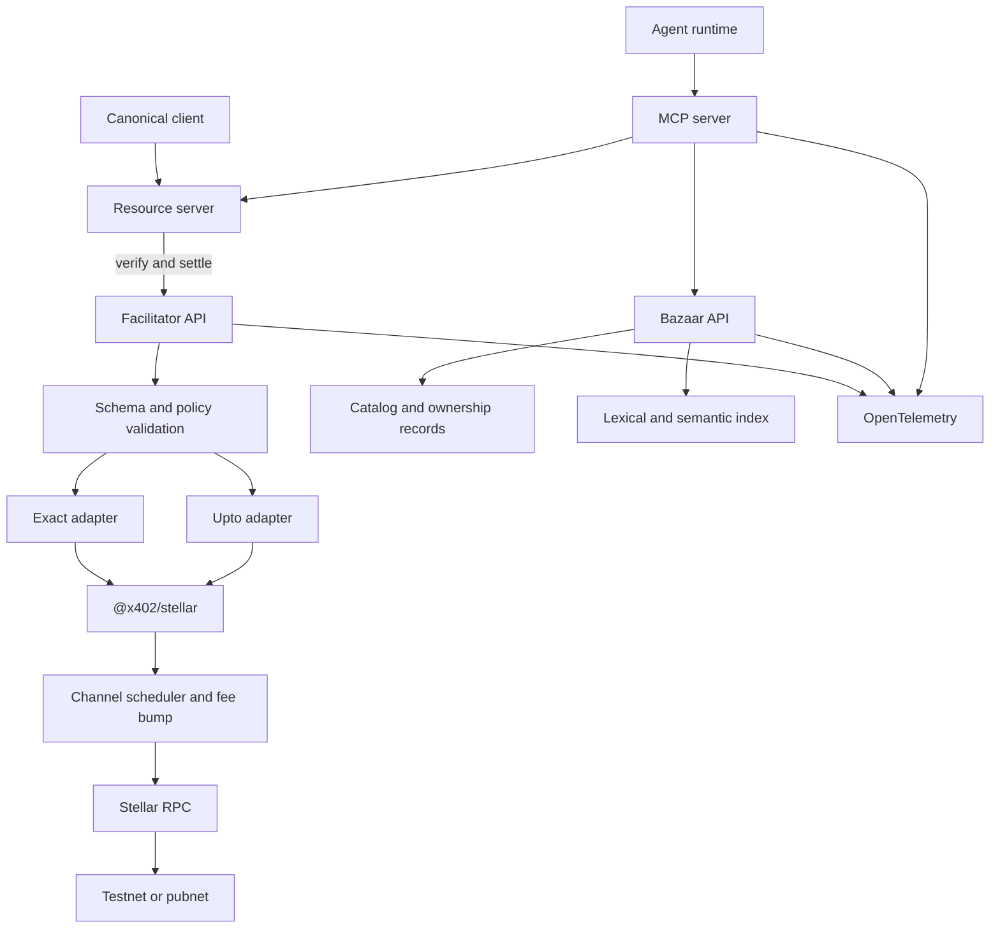

# Architecture

## Design goals

1. Canonical x402 v2 wire compatibility.
2. Native support for `stellar:testnet` and `stellar:pubnet` using CAIP-2 identifiers.
3. Hosted and self-hosted deployment from the same permissively licensed codebase.
4. No custody of buyer funds or buyer private keys.
5. Safe discovery without seller, route, or price spoofing.
6. Horizontal service scaling and parallel Stellar submission.
7. Minimal data collection and deterministic machine-readable errors.
8. Clean upstream contribution path for the Stellar `upto` scheme.

## Logical components

## Facilitator APIs

### `GET /supported`

Returns canonical supported scheme/network combinations. Stellar entries must include the required `extra` contract, including `areFeesSponsored`. Responses are versioned, cacheable for a short period, and never claim unavailable capability.

### `POST /verify`

Validates protocol version, scheme, CAIP-2 network, asset, amount/cap, destination, expiration ledger, auth entries, transaction structure, resource binding, fee ceiling, and replay state. It returns canonical `VerifyResponse` with a non-null reason for all invalid results.

### `POST /settle`

Repeats all security-critical verification, claims an idempotency key, selects an available channel account, fee-bumps when configured, submits the invocation, waits for the defined finality state, and returns the canonical settlement response.

## Stellar-specific design

- Use auth entries, not pre-signed final transactions, where required by the canonical Stellar scheme.
- Derive `signatureExpirationLedger` from `maxTimeoutSeconds`; default behavior targets roughly 12 ledgers or 60 seconds unless the stable upstream implementation changes.
- Require asset compatibility and recipient trustline readiness where applicable; developer examples include onboarding.
- Enforce Soroban transaction resource and fee ceilings before submission.
- Avoid sequence bottlenecks with a pool of isolated channel accounts and a separate fee-bump signer.
- Do not introduce an on-chain registry in v1. If a registry is later proposed, it requires a TTL/rent strategy and a separate ADR.

## Bazaar design

### Interfaces

- `GET /discovery/resources`: canonical filters, pagination, deterministic ordering, and metadata validation.
- `GET /discovery/search`: natural-language query with lexical and semantic ranking, filters, explainable scores, and a published evaluation set.

### Cataloging

Resources enter the catalog through verified observation of the discovery extension or an ownership challenge. The index stores the observed canonical metadata, source URL, network/scheme data, verification status, timestamps, and content hash. A seller cannot claim another origin, route template, or payment destination.

Automatic cataloging supports both HTTP and MCP resources. Crawling is bounded, rate-limited, and opt-out aware. Listings expire or are revalidated so stale prices and endpoints are not presented as current.

### Search quality

Search combines field filters, lexical ranking, and optional embeddings. The default self-hosted path must not require sending queries to a third party. Quality is measured on a versioned query/relevance dataset with precision, recall, and ranking metrics.

## MCP design

Planned tools:

- `search_resources`: structured filters plus natural-language query;
- `get_resource`: canonical metadata and payment options;
- `paid_call`: discover or accept a resource, execute the x402 pay/retry loop, and return structured payment and resource results.

Inputs and outputs use stable schemas. Every rejection has a code and non-null reason. The MCP service never receives or stores a buyer seed phrase; signing remains in the client or wallet boundary.

## `upto` design boundary

The project will author `scheme_upto_stellar.md` and coordinate it with the x402 Technical Steering Committee. The v1 proposal is contract-free to match the RFP's stated audit assumptions. This has a weaker on-chain trust model than a dedicated recipient-bound, single-settlement Soroban contract.

The implementation must document that gap explicitly and mitigate it with bounded authorizations, recipient/asset/cap/resource binding in signed material, short ledger expiration, idempotent single settlement, immutable audit records, and buyer smart-account spending policies. A contract-backed design requires a new ADR, audit scope, and acceptance plan.

## Deployment

All services are containerized and independently scalable. Production separates:

- public API and MCP ingress;
- catalog workers;
- settlement workers;
- channel-account signer boundary;
- database and index;
- telemetry pipeline.

Managed deployments should use KMS/HSM-backed secret handling where Stellar signing compatibility permits. Self-hosters supply their own RPC, database, and keys.
