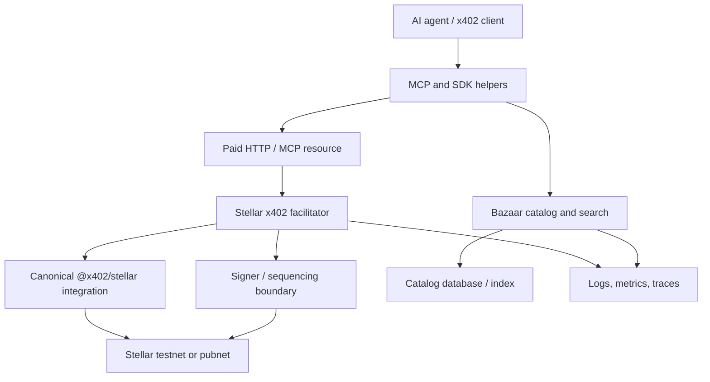

# SCF #45 Build Award — panel review reference

This document is the repository-side reference for AiFinPay's SCF #45 Build Award submission. The SCF portal submission remains authoritative if wording differs. This file is maintained so reviewers can quickly inspect the technical implementation plan, team, USD 90,000 budget, milestones and evidence model in one place.

## Project

**Name:** Stellar x402 Facilitator  
**Organization:** AiFinPay  
**Track:** SCF #45 Build Award — x402 Facilitator with Bazaar Discovery RFP  
**Requested amount:** **USD 90,000**  
**Delivery target:** eight weeks to controlled production, followed by stabilization, upstream coordination, audit remediation and maintenance through the award period

## One-sentence summary

AiFinPay will build an Apache-2.0, production-oriented x402 facilitator for Stellar testnet and pubnet using canonical `@x402/stellar` settlement, with Bazaar-compatible discovery, MCP-native agent access, SDK helpers, conformance evidence and production operations.

## Problem

Stellar already has canonical x402 settlement support, but developers still need an operational layer that can be consumed as a hosted service or deployed independently: reliable facilitator endpoints, discovery, agent/MCP interfaces, observability, security controls, conformance evidence and production runbooks. Without that layer, every integrator must assemble these pieces separately and prove compatibility on their own.

## Proposed technical implementation

AiFinPay will deliver:

1. **Hosted and self-hostable facilitator** for `stellar:testnet` and `stellar:pubnet`.
2. **Canonical x402 endpoints**: `/supported`, `/verify`, `/settle`, with deterministic machine-readable rejection reasons.
3. **Canonical Stellar settlement integration** through `@x402/stellar`; the project will not create a competing settlement protocol.
4. **Durable operational state** for idempotency, settlement status, transaction evidence and recovery, while keeping signing material isolated from public application processes.
5. **Bazaar-compatible discovery** with automatic registration, normalized HTTP/MCP resource metadata, provenance/ownership controls and natural-language search.
6. **MCP interface and SDK helpers** that allow agent runtimes and developers to discover paid resources, interpret payment requirements and retry paid calls through canonical flows.
7. **Stellar `upto` contribution** as a reviewable specification, implementation and tests proposed upstream; external merge/acceptance is not represented as team-controlled.
8. **Conformance and production evidence**: upstream-compatible tests, negative/replay cases, public transaction hashes, load/failover evidence, SBOM/license controls, monitoring, degraded modes and rollback runbooks.
9. **Two end-to-end reference integrations** and role-based documentation for operators, API sellers, client/wallet developers and agent developers.
10. **Security review readiness and remediation** through the SCF Audit Bank process, with security-sensitive releases blocked by unresolved fund-safety findings.

### System boundary

The edge service validates canonical request shapes, applies idempotency and policy controls, and delegates Stellar-specific verification/settlement to canonical libraries. The Bazaar layer indexes public resource metadata and provenance without becoming the authority over seller pricing. The MCP layer exposes discovery and paid-call workflows to agent runtimes without storing agent private keys.

Detailed design: [`../ARCHITECTURE.md`](../ARCHITECTURE.md), [`../SECURITY_MODEL.md`](../SECURITY_MODEL.md), [`../THREAT_MODEL.md`](../THREAT_MODEL.md), [`RFP_COMPLIANCE_MATRIX.md`](RFP_COMPLIANCE_MATRIX.md).

## Why Stellar

The work is Stellar-specific at the settlement, asset, authorization and operations layers. The implementation must handle explicit Stellar network identifiers, SEP-41 assets, Stellar authorization entries, ledger-bound validity, trustline/balance preflight, Soroban resource constraints where applicable, accurate fee-sponsorship reporting, and throughput/sequence-management strategies appropriate to production Stellar usage.

The objective is to reduce the integration cost for paid HTTP APIs and agent-driven services that want to use Stellar while preserving canonical x402 interoperability.

## Existing execution foundation

The Stellar facilitator itself is new grant work. AiFinPay does, however, already maintain public payment infrastructure that demonstrates relevant implementation experience:

- agent payment SDK and MCP tooling: <https://github.com/AiFinPay/sdk>
- public smart-contract infrastructure: <https://github.com/AiFinPay/evm-contract>
- live product and protocol discovery surface: <https://aifinpay.io>

These assets are evidence of execution capability and reusable engineering experience. **They are not billed as SCF deliverables and do not replace Stellar-specific acceptance evidence.**

## Technical implementation team

| Contributor | Role for SCF #45 | Allocation |
| --- | --- | ---: |
| **Pavlo Bolhar** | CTO; facilitator/backend and production operations | **8 person-weeks** |
| **Syed Hassan** | Web3 Lead; Stellar/x402 integration, conformance and payment-security logic | **8 person-weeks** |
| **Pavel Svizinskiy** | Full-Stack Developer; Bazaar, MCP, SDK and reference integrations | **7 person-weeks** |
| **Nick Staetskiy** | Discovery & Quality Owner; search evaluation, abuse/relevance and reliability evidence | **5 person-weeks** |
| **Dmitry Buhaienko** | Founder & CEO; product acceptance, technical documentation, release evidence and SCF reporting | **4 person-weeks** |
| **Iryna Zavorotnia** | Head of Finance; budget governance and supporting-document control | Internal support; not charged as technical labor |

Total award-funded delivery capacity is **32 person-weeks**, averaging four FTE across the eight-week window. Public profiles, responsibilities and review ownership are documented in [`TEAM.md`](TEAM.md) and [`../../MAINTAINERS.md`](../../MAINTAINERS.md).

## Budget feasibility

**Requested award: USD 90,000.**

| Cost category | Amount |
| --- | ---: |
| Facilitator backend, deployment and observability | **USD 22,000** |
| Stellar/x402 integration, conformance and `upto` contribution | **USD 20,000** |
| Bazaar, MCP, SDK and reference integrations | **USD 17,500** |
| Search quality, reliability and evidence work | **USD 12,500** |
| Product acceptance, technical docs, release evidence and SCF reporting | **USD 10,000** |
| Direct development/test infrastructure, capped | **USD 8,000** |
| **Total** | **USD 90,000** |

The labor plan is 32 person-weeks, all tied to named workstream owners. Infrastructure is separated and capped rather than hidden in labor. No general marketing, legal/entity setup, token/liquidity work, past AiFinPay development or separate Audit Bank fees are included. Full methodology: [`BUDGET.md`](BUDGET.md).

## Deliverables and payment gates

| Gate | Share / amount | Outcome required before completion claim |
| --- | ---: | --- |
| **Award setup** | **10% / USD 9,000** | Final interfaces, architecture/ADRs, dependency baseline, CI, implementation backlog and named delivery controls |
| **MVP** | **20% / USD 18,000** | Working canonical endpoints, first successful testnet settlement, initial Bazaar/MCP/SDK flow and reproducible example |
| **Testnet** | **30% / USD 27,000** | Complete testnet conformance, search/discovery controls, replay/negative/security/reliability evidence, two examples and reviewable `upto` contribution |
| **Mainnet** | **40% / USD 36,000** | Controlled pubnet release, self-hostable package, final conformance, monitoring/runbooks, audit remediation and complete public evidence package |

Detailed owner/evidence gates: [`MILESTONES.md`](MILESTONES.md).

## Hard acceptance criteria

The project is not considered production-ready until the following are independently verifiable:

- an unmodified canonical x402 client completes an end-to-end payment on both `stellar:testnet` and `stellar:pubnet`;
- `/supported` reports required Stellar metadata, including accurate `areFeesSponsored` behavior;
- canonical payloads are accepted without proprietary required fields;
- settlement results contain the expected canonical transaction evidence;
- every rejection has a stable non-null machine-readable reason;
- transaction hashes and the exact software revision are published for required network evidence;
- discovery prevents or detects seller, endpoint and price spoofing and exposes provenance;
- Bazaar and MCP discovery resolve equivalent normalized resource identities;
- replay, duplicate-settlement, authorization-boundary and ledger-expiration cases are covered by automated tests;
- two runnable end-to-end examples and an under-one-hour clean-room onboarding record exist;
- production monitoring, degraded modes, rollback procedures and maintenance ownership are documented;
- security review findings affecting fund safety are remediated or formally dispositioned before the production completion claim.

## Open source and ecosystem value

The project is Apache-2.0 and self-hostable. AiFinPay-specific extensions must be optional, namespaced and backward-compatible. Reusable Stellar/x402 conformance work and the `upto` contribution will be proposed upstream where appropriate so the ecosystem is not dependent on one hosted operator.

The ecosystem value is the combination of four reusable capabilities in one permissively licensed delivery: canonical Stellar settlement integration, production facilitator operations, Bazaar-compatible discovery and MCP-native discovery/payment tooling.

## Risks and controls

Primary delivery risks include specification drift, signer compromise, replay/authorization flaws, discovery spoofing, search-quality failures, throughput limits, upstream `upto` review uncertainty, staffing conflicts and audit findings. Every material risk has a named owner, observable trigger and mitigation in [`RISK_REGISTER.md`](RISK_REGISTER.md).

## Evidence model

Reviewers should not need to accept narrative claims on trust. Each acceptance gate updates [`EVIDENCE_REGISTER.md`](EVIDENCE_REGISTER.md) with the exact public artifact used to prove it: release/tag, CI run, test report, transaction hash, load/failover result, documentation contribution, SBOM/license report or security-remediation record.

The concise reviewer index is available in [`PANEL_REVIEW_BRIEF.md`](PANEL_REVIEW_BRIEF.md).
